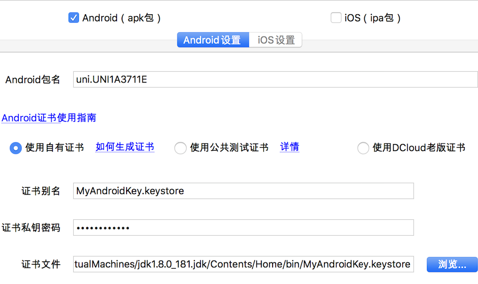

# 申请Android证书

> 磁盘中已有Java jdk

### 一、全局搜索Java文件
windows: /Java/jdk1.8.0_181.jdk/bin

mac: /Java/JavaVirtualMachines/jdk1.8.0_181.jdk/Contents/Home/bin

### 二、进入bin文件打开终端
mac:先输入sudo -s 获取权限 密码为开机密码

windows不需要

### 三、终端输入命令
```
keytool -genkey -alias android.keystore -keyalg RSA -validity 20000 -keystore android.keystore
```
-validity 20000中的`20000`为有效天数

android.keystore中的`android`为证书名称

### 四、bin文件中存在一个后缀名为`.keystore`文件,该文件就是证书了

### 五、uni-app打包使用

