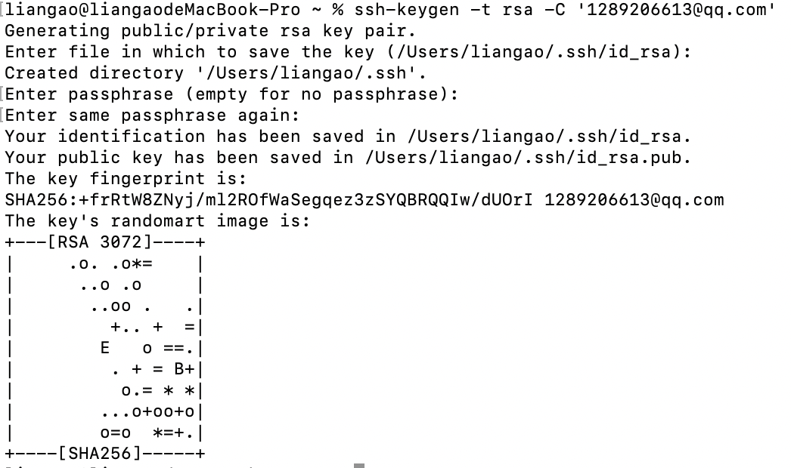

# 本地生成密钥

### mac方法

##### 生成密钥
``` 终端
ssh-keygen -t rsa -C '1289206613@qq.com'
```

1. 一路回车。如下：
----------------------

---------------------
2. 密钥地址`/Users/liangao/.ssh/id_rsa`
3. 打开密钥，终端输入`open /Users/liangao/.ssh`
4. 查看`id_rsa`文件

##### 打开隐藏文件


```终端
defaults write com.apple.finder AppleShowAllFiles TRUE
killall Finder
```

##### 访问root用户

- 如果生成密钥的地址在`/var/root/.ssh/`文件内。需要[切换root用户](https://support.apple.com/zh-cn/HT204012)
